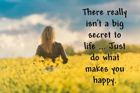

```{r setup, include=FALSE}
knitr::opts_chunk$set(echo = TRUE)
```

Like holding hands with the person you love, happiness is a simple unforgetable moment in our lives. But is everyone experiencing happiness the same or drastically different?

With the technology that can help us understand how people describe their happiness, we present the following analysis to visualize and understand the science behind happiness by using deeper NLP methdologies in positive psychology. I want to specially thank Arpita Shah and Tian Zheng for providing coding resources for this R notebook.

```{r pressure, echo=FALSE, fig.cap="Happiness is when what you think, what you say, and what you do are in harmony. ---Gandhi", out.width = '100%'}

```

# INTRODUCTION 

This project happily unites science and art. The study of happiness is an area of positive psychology that studies the factors that sustain people's happiness in their lives. What are some factors we can associate ourselves with when we are study the science about happiness? Is it money? Is it marital status? Or is it material belongings?

## Background

Asai et al (2018) proposed a data set and outlines a few NLP problems that can be studied with. HappyDB is a corpus of 100,000 crowd-sourced happy moments via Amazon's Mechanical Turk. Please refer to Asai et al (2018) which can be accessed on https://arxiv.org/abs/1801.07746. We explore this data set and try to answer the question, "What makes people happy?" 

# EXPLORATORY ANALYSIS

This section we dive into the analysis and technical part of the project.

```{r load libraries, warning=FALSE, message=FALSE, echo=FALSE, error=FALSE}
#Let us introduce all the packages used in this notebook. 

#+ `tidyverse` is an opinionated collection of R packages designed for data science. All packages share an underlying design philosophy, grammar, and data structures;
#+ `tidytext` allows text mining using 'dplyr', 'ggplot2', and other tidy tools;
#+ `DT` provides an R interface to the JavaScript library DataTables;
#+ `scales` map data to aesthetics, and provide methods for automatically determining breaks and labels for axes and legends;
#+ `wordcloud2` provides an HTML5 interface to wordcloud for data visualization;
#+ `gridExtra` contains miscellaneous functions for "grid" graphics;
#+ `ngram` is for constructing n-grams (“tokenizing”), as well as generating new text based on the n-gram structure of a given text input (“babbling”);
#+ `Shiny` is an R package that makes it easy to build interactive web apps straight from R;

# Packages
#install.packages(c("tidyverse", "tidytext", "DT", "scales", "wordcloud2","gridExtra", "ngram", "shiny"))
library(tidyverse)
library(tidytext)
library(DT)
library(scales)
library(wordcloud2)
library(gridExtra)
library(ngram)
library(shiny) 
library(shiny)
library(plotly)
library(vioplot)
```

```{r load data, warning=FALSE, message=FALSE, echo=FALSE}
# Load the processed text data along with demographic information on contributors
hm_data <- read_csv("../output/processed_moments.csv")

urlfile<-'https://raw.githubusercontent.com/rit-public/HappyDB/master/happydb/data/demographic.csv'
demo_data <- read_csv(urlfile)
```

```{r combining data, warning=FALSE, message=FALSE, echo=FALSE}
# Combine both the data sets and keep the required columns for analysis
hm_data <- hm_data %>%
  inner_join(demo_data, by = "wid") %>%
  select(wid,
         original_hm,
         gender, 
         marital, 
         parenthood,
         reflection_period,
         age, 
         country, 
         ground_truth_category, 
         text) %>%
  mutate(count = sapply(hm_data$text, wordcount)) %>%
  filter(gender %in% c("m", "f")) %>%
  filter(marital %in% c("single", "married")) %>%
  filter(parenthood %in% c("n", "y")) %>%
  filter(reflection_period %in% c("24h", "3m")) %>%
  mutate(reflection_period = fct_recode(reflection_period, 
                                        months_3 = "3m", hours_24 = "24h"))
```

Let us take a quick preview of what the data set looks like.

```{r, echo=FALSE}
datatable(
  hm_data,
  options = list(pageLength = 5))
```

```{r bag of words, warning=FALSE, message=FALSE, echo=FALSE}
# Create a bag of words using the text data
bag_of_words <-  hm_data %>%
  unnest_tokens(word, text)

word_count <- bag_of_words %>%
  count(word, sort = TRUE)
```

```{r bigram, warning=FALSE, message=FALSE, echo=FALSE}
# Create bigrams using the text data
hm_bigrams <- hm_data %>%
  filter(count != 1) %>%
  unnest_tokens(bigram, text, token = "ngrams", n = 2)

bigram_counts <- hm_bigrams %>%
  separate(bigram, c("word1", "word2"), sep = " ") %>%
  count(word1, word2, sort = TRUE)
```

# WHAT CONSISTS OF HAPPINESS

When we are happy, what sort of memory do we associate ourselves with? Are we feeling happy when we eat delicious food? Or are we feeling happy when we are with friends and family? To start to answer this kind of question, we dive into the data set by the text input of HappyDB data. 

A global view is to see what are some high frequency words in the data set when people are asked to recall their past moments of happiness. We can do a word cloud on all the text inputs choosing top 50 words. 

```{r, message=FALSE, error=FALSE, warning=FALSE, echo=FALSE}
# Word Count with Top 50 Words
word_count %>%
  slice(1:50) %>%
  wordcloud2(size = 0.6,
             rotateRatio = 0)
```

## What Words Do We Say

The top qords can further be notated and analyzed by taking a look at the exact frequency. We have top words to be ``friend''. There is an old saying misfortune tests the sinceretry of friends. Well, so does statistics, right?

```{r, message=FALSE, error=FALSE, warning=FALSE, echo=FALSE}
# Word Frequency with Top 20 Words
word_count %>%
  slice(1:20) %>%
  mutate(word = reorder(word, n)) %>%
  ggplot(aes(word, n)) +
  geom_col() +
  xlab(NULL) +
  ylab("Word Frequency")+
  coord_flip()
```

## Is Happiness Different Between Genders

In kindergarten, people generally associate boys with guns and girls with barbies. Do gender truly reveal a difference when people associate themselves with happy memories. We can compose a scatter plot of the frequency of words each gender associate themselves with when asked to bring up a happy memory. In this case, the scatter has "female" on the x-axis and "male" on the y-axis. We can see that a typical piece of information is "basketball" which happen to have a larger frequency for "male" and "female". A notable example is "makeup" for "female" but not so much for "male". 

```{r, message=FALSE, error=FALSE, warning=FALSE, echo=FALSE}
# Scatter Plot According to "gender"
enter <- "gender"
selectedAttribute <- function(enter) {
  return(list(
    atr = enter
  ))
}
temp <- bag_of_words %>%
  count(!!as.name(selectedAttribute(enter)$atr), word) %>%
  group_by(!!as.name(selectedAttribute(enter)$atr)) %>%
  mutate(proportion = n / sum(n)) %>% 
  select(-n) %>% 
  spread(!!as.name(selectedAttribute(enter)$atr), proportion)

ggplot(temp, 
       aes_string(x = colnames(temp)[2], y = colnames(temp)[3]),
       color = abs(colnames(temp)[3] - colnames(temp)[2])) +
  geom_abline(color = "gray40", lty = 2) +
  geom_jitter(alpha = 0.1, size = 1, width = 0.3, height = 0.3) +
  geom_text(aes(label = word), check_overlap = TRUE, vjust = 1.5) +
  scale_x_log10(labels = percent_format()) +
  scale_y_log10(labels = percent_format()) +
  scale_color_gradient(limits = c(0, 0.001), low = "darkslategray4", high = "gray75") +
  theme(legend.position="none")
```

## Married or Single

Is marriage an important factor to differentiate memories of happiness? We can do a scatter plot of frequency of words according to "married" and "single". In the following plot, we have "married" on the x-axis and "single" on the y-axis. Intuitively, "child" happen to be a word that associate with "married" people when they find themselves in happiness. 

```{r, message=FALSE, error=FALSE, warning=FALSE, echo=FALSE}
# Scatter Plot According to "marital"
enter <- "marital"
selectedAttribute <- function(enter) {
  return(list(
    atr = enter
  ))
}
temp <- bag_of_words %>%
  count(!!as.name(selectedAttribute(enter)$atr), word) %>%
  group_by(!!as.name(selectedAttribute(enter)$atr)) %>%
  mutate(proportion = n / sum(n)) %>% 
  select(-n) %>% 
  spread(!!as.name(selectedAttribute(enter)$atr), proportion)

ggplot(temp, 
       aes_string(x = colnames(temp)[2], y = colnames(temp)[3]),
       color = abs(colnames(temp)[3] - colnames(temp)[2])) +
  geom_abline(color = "gray40", lty = 2) +
  geom_jitter(alpha = 0.1, size = 1, width = 0.3, height = 0.3) +
  geom_text(aes(label = word), check_overlap = TRUE, vjust = 1.5) +
  scale_x_log10(labels = percent_format()) +
  scale_y_log10(labels = percent_format()) +
  scale_color_gradient(limits = c(0, 0.001), low = "darkslategray4", high = "gray75") +
  theme(legend.position="none")
```

## Does Culture Have Nationality

Will happiness change in different country? We can think about this kind of question using United States as an example. We can create an indicating variable telling us whether a country is United States or not. We can then do a boxplot on age. For United States, people who expressed happy moments in the text have a wider age distribution than that of the rest of the world. We can also take a look at the violin plot with a kernel smoothing technique to see a better view of the distribution.

```{r, message=FALSE, error=FALSE, warning=FALSE, echo=FALSE}
# Define a binary variable indicating whether a country is USA or not
hm_data$usa.or.not <- ifelse(hm_data$country == "USA", 1, 0)
Age = as.numeric(hm_data$age)
USA = hm_data$usa.or.not
new.data <- data.frame(cbind(
  Age, USA
))
new.data.1 <- new.data[new.data$USA == 1, 1]
new.data.0 <- new.data[new.data$USA == 0, 1]
data.usa.age <- data.frame(cbind(
  new.data.1[1:100], 
  new.data.0[1:100]
))

# Interactive Box Plot
# Create a shareable link to your chart
# A basic boxplot
boxplot(data.usa.age, main = "BoxPlot of Age for People in USA vs. People not in USA")

# Viola Plot
vioplot(data.usa.age$X1, data.usa.age$X2, names=c("From USA", "Not From USA"), 
   col="gold")
```

## Heatmap of a Deeper Analysis

From above, we understand there may be an association between age and nationality. We can add one more variable, word count, in the analysis and take a look at three-way interaction from a heatmap. 

```{r, message=FALSE, error=FALSE, warning=FALSE, echo=FALSE}
# Define a binary variable indicating whether a country is USA or not
new.data <- data.frame(cbind(
  hm_data$age[1:1000],
  #kmeans(hm_data$age[1:100], centers = 5)$cluster,
  hm_data$count,
  hm_data$usa.or.not
  #hm_data$single.or.not
))[1:1000, ]
new.data <- new.data[sort(new.data$X2), ]
colnames(new.data) <- c("Age", "Count", "USA")

# Interactive Heat Map
heatmap(data.matrix(new.data), scale="column")
#hc.rows <- hclust(dist(scale(new.data)))
#plot(hc.rows)
```

# SUMMARY

The blog shares with readers a few exploratory results on HappyDB data set and attempts to understand the question ``what makes people happy''. 

# REFERENCE

Asai et al (2018), "HappyDB: A Corpus of 100,000 Crowdsourced Happy Moments", https://arxiv.org/abs/1801.07746. 